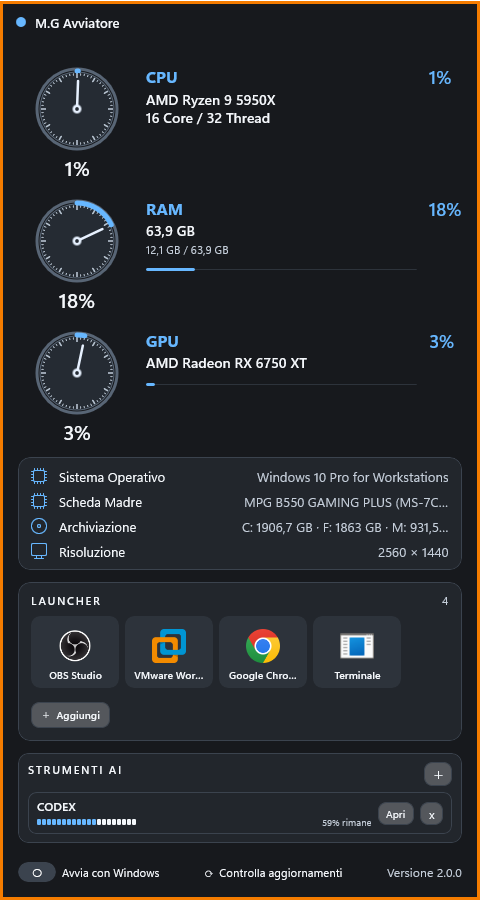

# M.G Avviatore 2.1.0

M.G Avviatore e un widget e launcher compatto per Windows: rende rapidamente accessibili programmi e collegamenti, con le informazioni essenziali del PC sempre a vista.

## Funzioni principali

- Nuovo layout grafico moderno, compatto e leggibile.
- Monitor CPU, RAM e GPU.
- Monitor rete con download, upload e ping.
- Informazioni su Sistema Operativo, Scheda Madre, Archiviazione e Risoluzione.
- Launcher ridisegnati a griglia per programmi, file, cartelle, siti e collegamenti.
- Temi e bordo personalizzabile.
- Integrazione con Codex e Claude Code quando disponibili.
- Avvia con Windows.
- Spegnimento automatico programmabile.
- Pagina "Chi sono".
- Controllo aggiornamenti integrato tramite GitHub Releases.

Alcuni dati possono mostrare N/D quando non sono disponibili sul sistema.

## Download e installazione

**Versione disponibile:** M.G Avviatore 2.1.0
**Compatibilita:** Windows 10 e Windows 11, 64 bit.

- [Release ufficiale 2.1.0](https://github.com/gregoriomangano/mg-avviatore/releases/tag/v2.1.0)
- [Download diretto: MG-Avviatore-Setup-2.1.0.exe](https://github.com/gregoriomangano/mg-avviatore/releases/download/v2.1.0/MG-Avviatore-Setup-2.1.0.exe)

Durante l'aggiornamento dalla versione precedente vengono conservati launcher, temi, bordo, posizione, dimensione e preferenze utente.

## Novita 2.1.0

- Nuovo monitor rete con download, upload e ping.
- Rilevamento di Windows 10 e Windows 11 migliorato.
- Nuova utilita di spegnimento automatico.
- Nuova pagina "Chi sono".
- Ulteriori miglioramenti al comportamento del widget.

## Novita 2.0.2

- Corretto un problema dell'installer che, in alcune configurazioni, poteva riutilizzare una vecchia cartella di installazione.
- Gli aggiornamenti ora utilizzano sempre la cartella ufficiale di M.G Avviatore.
- Launcher e preferenze dell'utente vengono mantenuti.

## Novita 2.0.1

- Comportamento corretto da widget desktop, senza presenza nella barra delle applicazioni.
- Impedite le istanze duplicate.
- Corretta l'icona nel menu Start.
- Le configurazioni dell'utente vengono mantenute durante l'aggiornamento.

## Aggiornamenti

All'avvio M.G Avviatore controlla GitHub in background. Quando e disponibile una nuova versione, mostra **Nuova versione disponibile** e permette di scegliere **Aggiorna ora** oppure **Piu tardi**. E disponibile anche il comando **Controlla aggiornamenti**.

## Dati utente

Le configurazioni personali sono conservate separatamente dai file del programma in `%LOCALAPPDATA%\CoffeeWidget` e non vengono pubblicate nel repository.

## Autore

- [Sito](https://www.manganogregorio.it/)
- [YouTube](https://www.youtube.com/@GregorioMangano)
- [GitHub](https://github.com/gregoriomangano)

## Codice e licenza

M.G Avviatore e software proprietario e closed source. Il codice sorgente non viene distribuito pubblicamente.
