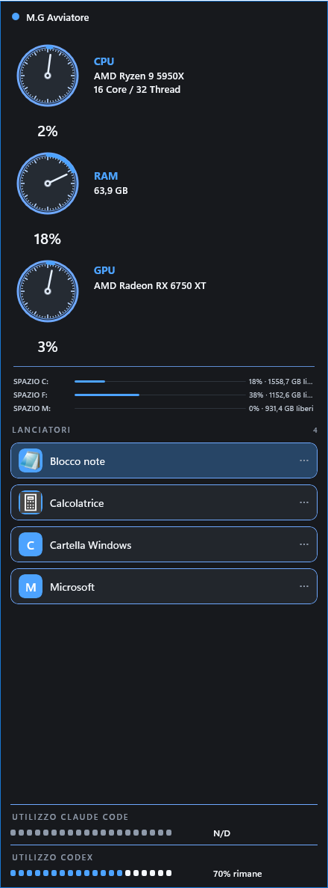

# M.G Avviatore

M.G Avviatore è un launcher/widget compatto per Windows pensato per tenere programmi, cartelle, file e collegamenti rapidamente accessibili direttamente dal desktop, mostrando allo stesso tempo informazioni essenziali sul PC.

## Che cos'è

Una piccola interfaccia personalizzabile per avere a portata di mano ciò che serve ogni giorno, insieme a CPU, RAM, GPU e informazioni hardware.

## Funzioni principali

- Launcher personalizzabili per programmi, file, cartelle, siti e collegamenti.
- Aggiunta, modifica ed eliminazione dei launcher; ricerca dei programmi installati.
- Monitor CPU, RAM e GPU, informazioni hardware e spazio su disco.
- Temi grafici e avvio automatico con Windows.
- Utilizzo Codex e Claude Code quando il dato è disponibile.
- Controllo automatico degli aggiornamenti e comando manuale **Controlla aggiornamenti**.
- Aggiornamento con un clic tramite GitHub Releases.

Alcuni dati possono mostrare N/D quando non sono disponibili sul sistema.

## Screenshot

## Download e installazione

**Versione disponibile:** M.G Avviatore 1.0.0  
**Compatibilità:** Windows 10 e Windows 11, 64 bit.

**[Scarica la Release ufficiale 1.0.0](https://github.com/gregoriomangano/mg-avviatore/releases/tag/v1.0.0)**  
**[Download diretto dell'installer](https://github.com/gregoriomangano/mg-avviatore/releases/download/v1.0.0/MG-Avviatore-Setup-1.0.0.exe)**

1. Scarica l'installer dalla Release ufficiale.
2. Apri MG-Avviatore-Setup-1.0.0.exe.
3. Completa l'installazione.
4. Avvia M.G Avviatore dal menu Start.

## Se compare Windows SmartScreen

Questa versione non possiede ancora una firma digitale commerciale. Windows può quindi mostrare l'avviso **Autore sconosciuto**.

Se il file è stato scaricato dal repository ufficiale, puoi scegliere **Ulteriori informazioni** → **Esegui comunque**. Non è necessario disattivare SmartScreen o Defender.

**SHA-256 dell'installer 1.0.0:** c371a9b57ae9787f75c9b161a02d14690f5ee7e8d886dc4259f44b4cb1e4eb2b

## Aggiornamenti

All'avvio M.G Avviatore controlla GitHub in background. Se è disponibile una nuova versione, mostra **Nuova versione disponibile** con le opzioni **Aggiorna ora** e **Più tardi**: l'installazione non avviene mai senza conferma.

Dal menu contestuale è disponibile anche **Controlla aggiornamenti**. Durante l'aggiornamento vengono conservati launcher, tema, preferenze e configurazione dell'utente.

## Dati utente

Le configurazioni personali sono conservate separatamente dai file del programma e non vengono pubblicate nel repository.

## Autore

M.G Avviatore è sviluppato da Gregorio Mangano.

- [YouTube](https://www.youtube.com/@GregorioMangano)
- [Sito](https://www.manganogregorio.it/)
- [Contatti](https://www.manganogregorio.it/contatti-gregorio-mangano-mondovi/)
- [GitHub](https://github.com/gregoriomangano)

## Codice e licenza

M.G Avviatore è software proprietario e closed source. Il codice sorgente non viene distribuito pubblicamente.
